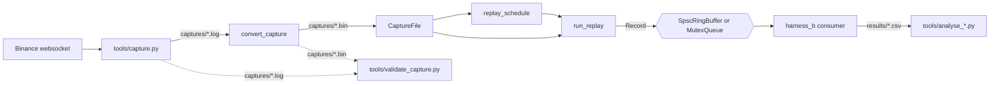

# Architecture

This document describes how the code is laid out: the components, the data
that flows between them, and which files implement each one. It deliberately
contains no measurements and no design rationale. Results and the reasoning
behind each choice are in the [README](README.md).

## Data flow

Everything left of `CaptureFile` runs once per capture, offline. Everything
from `CaptureFile` onward runs inside a measurement.

## Stages

**1. Capture — `tools/capture.py`.** Connects to the Binance USD-M futures
websocket and writes one line per message to `captures/`: the local receive
time in nanoseconds, a tab, then the raw JSON. `captures/` is gitignored.

**2. Parse — `src/parser.hpp`, `src/parser.cpp`.** Turns one bookTicker JSON
message into a `CaptureRecord`: scaled integer prices and quantities, no
floating point, no allocation, no exceptions. This is the only C++ code that
reads JSON.

**3. Convert — `src/convert_capture.cpp`.** Drives the parser over a whole
`.log` and writes a `.bin`: a 64-byte header followed by a packed array of
`CaptureRecord`. It publishes the output atomically and only if every line
parsed.

**4. Read — `src/capture_file.hpp`, `src/capture_file.cpp`.** `CaptureFile`
opens a `.bin`, validates every header field once, memory-maps it and exposes
the records as `std::span<const CaptureRecord>`. The binary format itself is
defined in `capture_file.hpp`.

**5. Schedule — `src/replay_schedule.hpp`, `src/replay_schedule.cpp`.** Builds
the intended send time of every record before the measurement starts, either
at a fixed rate or from the captured gaps divided by a compression factor.

**6. Replay — `src/replay_producer.hpp`.** `run_replay` copies each
`CaptureRecord` into a `Record`, assigns its sequence number and pushes it at
its scheduled time. It is a template on the queue type, so the same producer
drives either queue.

**7. Queue — `src/spsc_ring_buffer.hpp`, `src/mutex_queue.hpp`.** Two
implementations of the same non-blocking interface, `try_push` and `try_pop`.
`MutexQueue` adds `wait_nonempty()` and `close()` for its own consumer; they
are not part of the shared interface.

**8. Consume — `src/harness_b.cpp`.** The consumer pops each `Record`, updates
a top-of-book, and records its sequence number and dequeue time.

## Record types — `src/record.hpp`

| Type | Size | Lives in | Written by |
|---|---|---|---|
| `CaptureRecord` | 56 bytes | the `.bin` on disk | the parser |
| `Record` | 80 bytes | the queue's slots | the replay producer |

`Record` embeds a `CaptureRecord` and adds the fields that belong to a run
rather than to the capture: `sequence`, `replay_intended_send_ns` and
`symbol_id`. Both sizes are `static_assert`ed in the header.

## Harnesses

| Program | Question it answers | Uses market data |
|---|---|---|
| `src/harness_a.cpp` | Queue microbenchmarks: ordering cost, padding, slot stride, index caching | No |
| `src/harness_b.cpp` | The full pipeline above under a controlled offered load | Yes |
| `src/harness_c.cpp` | Correctness stress with a sequence-number oracle | No |
| `src/c1_relaxed_publication.cpp` | Negative control: the ring with its consumer acquire removed. Intentionally invalid C++ | No |

`src/false_sharing.hpp` holds harness A's queue-free false-sharing and
slot-stride kernels. They live in a header so that `check_a2b_assembly`
disassembles the same code the harness runs.

## Supporting programs

| Program | Role |
|---|---|
| `src/calibrate.cpp` | Timer calibration; writes `results/timer_calibration.csv` |
| `src/measure_condvar_wakeup.cpp` | Cost of a condition-variable park and wake |
| `src/measure_parse_cost.cpp` | Parser cost against a queue handoff |
| `src/measure_pacing_floor.cpp` | The replay producer's own ceiling, with no queue attached |
| `src/verify_capture.cpp` | Opens a real `.bin` through `CaptureFile` and times two traversals |
| `src/environment_probe.cpp` | Standard-library facts, called by `env/dump_environment.sh` |
| `src/check_spsc_assembly.cpp`, `src/check_a2b_assembly.cpp` | Minimal binaries disassembled by `tools/make_*_evidence.py` |
| `src/check_record.cpp` | Prints `sizeof(Record)` |

## Shared helpers

- `src/measurement_thread.hpp` — requests a QoS class for the calling thread
  and reads it back, since macOS offers no thread pinning.
- `src/provenance.hpp` — checks the commit and dirty flag a timed program
  was given against git before it runs, and refuses on a mismatch.
- `src/test_child_process.hpp` — runs a function in a forked child so a test
  can assert that a precondition aborts.

## Tests

`ctest` runs seven test programs: `test_parser`,
`test_mutex_queue`, `test_spsc_ring_buffer`, `test_capture_file`,
`test_replay_schedule`, `test_replay_producer` and `test_convert_capture`.
The last runs the converter as a child process rather than linking it.
Harness C and C1 are not `ctest` entries.

## Tools and scripts

| File | Role |
|---|---|
| `tools/capture.py` | Stage 1 above |
| `tools/inspect_capture.py` | Routine checks on a capture `.log` |
| `tools/validate_capture.py` | Independent check of a `.bin` against its `.log`, not using the C++ parser |
| `tools/inspect_interarrival.py` | Inter-arrival and burstiness analysis of a capture |
| `tools/analyse_harness_b.py` | Harness B results into the comparison tables and graphs |
| `tools/analyse_tail_samples.py` | Harness B's slow-sample dump into stall statistics |
| `tools/classify_c1_runs.awk` | Classifies repeated C1 runs by outcome |
| `tools/make_spsc_evidence.py`, `tools/make_a2b_evidence.py` | Disassembly evidence files |
| `tools/mcpu_sweep.py`, `tools/interference_probe.cpp` | Interference-size sweep across GCC `-mcpu` targets |
| `tools/run_mutex_queue_controls.py` | Negative controls for `test_mutex_queue` |
| `scripts/plot_calibration.py` | Timer-calibration histogram |

## Dependency rules

These hold in the code today and are worth keeping:

- `record.hpp`, `spsc_ring_buffer.hpp` and `mutex_queue.hpp` include no other
  project header. The queues are templates on the element type and know
  nothing about market data.
- The parser is the only C++ that reads JSON. The pipeline itself reads
  captures only as a `.bin`, through `CaptureFile`.
- The Python validator deliberately does not reuse the C++ parser, so a bug
  in one cannot hide a bug in the other.

## Directories

| Directory | Contents | Committed |
|---|---|---|
| `src/` | All C++ | Yes |
| `tools/`, `scripts/` | Capture, analysis and evidence tooling | Yes |
| `env/` | Environment dumps and the `exchangeInfo` snapshot | Yes |
| `results/` | Measurement outputs | Yes, except the large slow-sample dump |
| `evidence/` | Disassembly, sanitizer and control records | Yes |
| `captures/` | Raw `.log` and converted `.bin` | No |
