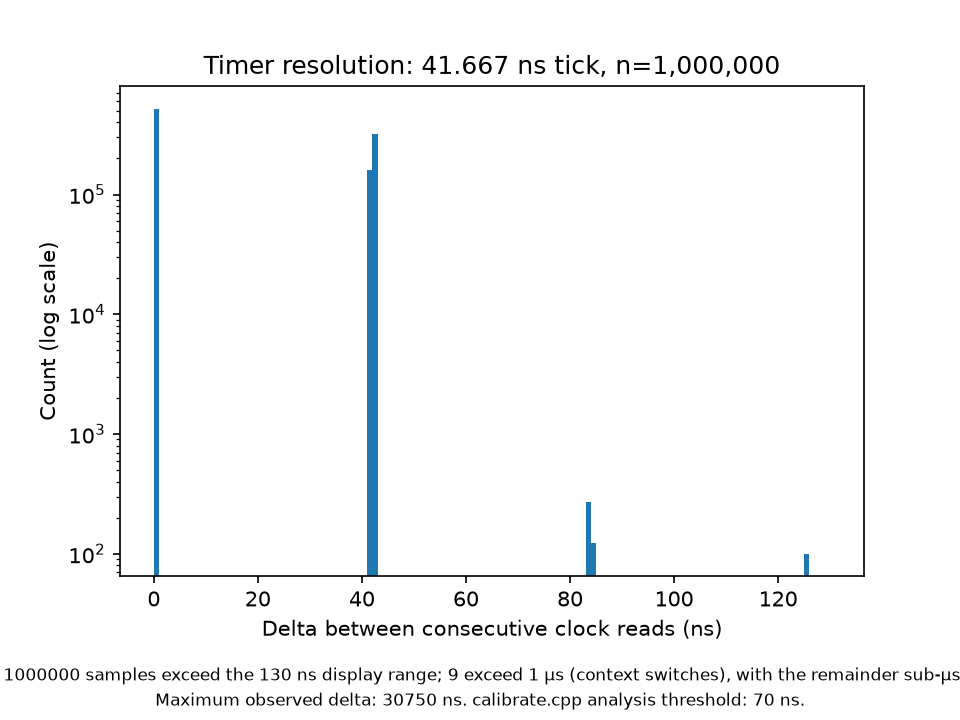

# Timer Calibration and Vernier Measurement

## Result

The measurement window between the two timer reads was estimated at approximately
**19.91 ns** on the run plotted here, with a range of roughly **19.5–22 ns** across eight
runs. This spread could be due to unpinned threads on heterogeneous P/E cores on a
fanless machine, and is itself a result: no experiment on this hardware can claim a
difference smaller than the run-to-run variance from a single run.

This window is smaller than the hardware timer's resolution of 41.667 ns, so it cannot
be measured directly from a single pair of readings so we use a vernier-style statistical
measurement instead.

---

## Timer Resolution

The resolution was obtained using `mach_timebase_info` which
returned `125 / 3`, meaning the timer increments every 41.667 ns — a frequency of
24 MHz.

This frequency describes the **hardware timer used for measurement**, not the frequency
at which the M2 CPU executes instructions.

---

## Timer Boundaries

Because the timer only increments once every 41.667 ns, its value remains constant
between two consecutive ticks. The exact instant at which the timer increments is
referred to here as a **timer boundary**.

                 timer boundary
                       |
                       v
-----------------------|-----------------------
   value = N              value = N + 1

Let two timer reads be performed, `t1` and `t2`. Let the actual time elapsed between
them be the **measurement window**.

If `t1` and `t2` occur within the same pair of timer boundaries, the timer has not
incremented between them:

boundary                         boundary
   |                                |
   |       t1 -------- t2           |
   |                                |

Both reads return the same timer value, so the measured difference is:
delta = 0

If instead `t1` and `t2` fall on either side of a timer boundary, the timer will have
incremented once between them:

                    boundary
                      |
             t1 ------|------ t2

Therefore the measured difference is one timer tick:
delta = 41.667 ns

So despite the measurement window being approximately 19.91 ns, an individual reading
will only ever report 0 ns or 41.667 ns.

---

## Vernier-Style Estimation

The timer cannot directly show 19.91 ns because it only updates every 41.667 ns.
But a smaller value can still be estimated by taking many measurements.

Each measurement is assumed to start at a roughly random point within the timer's
41.667 ns tick period. Because of this, some measurement windows cross a timer boundary
and some do not. We can use how often a boundary is crossed to find the size of the window:

measurement window  ≈  P(boundary crossing) × timer period

P(boundary crossing) ≈ K / N

`N` - the total number of measurements
`K` - the number that crossed a boundary.

For example, if approximately 48% of samples cross a boundary:

0.48 × 41.667 ≈ 20 ns

This estimates a time smaller than one timer tick even though the timer cannot show
that value directly. This type of measurement is called a **vernier-style measurement** because many less
precise measurements are used to estimate a more precise result.

From the measured data, the estimated window was approximately **19.91 ns**.

---

## Histogram as Evidence

The histogram supports the result. Nearly all measurements fall at either 0 ns or
41.667 ns, which is exactly what a timer updating every 41.667 ns should produce:

0 ns        → no timer boundary was crossed
41.667 ns   → one timer boundary was crossed

Values such as 10 ns or 20 ns should not appear, because the timer cannot represent
them.

---

## Excluding Interrupted Measurements

The vernier method assumes the gap between the two reads is small enough to cross **no
more than one timer boundary**.

one tick  = 41.667 ns
two ticks = 83.333 ns

Since the estimated window is only about 19.91 ns, an uninterrupted measurement should
produce either 0 ns or 41.667 ns and nothing larger.

A cutoff of **70 ns** was therefore used, sitting between one and two ticks:

41.667 < 70 < 83.333

Any measurement above 70 ns is caused by something interrupting or delaying the
program, rather than by normal timer behaviour. These are excluded so they do not
affect the estimate.

---

## Outlier Populations

The excluded measurements fall into two distinct groups:

| Population         | Count |                 Cause                   |
|--------------------|-------|-----------------------------------------|
| Multi-tick         | 746   |             Memory stalls               |
| Microsecond-scale  | 9     | Context switches / scheduling delays    |

These are not part of normal timer behaviour. 

The 9 context-switch measurements matter later: they are evidence of the scheduling
delay that is expected to produce the long-latency tail in the mutex baseline (B1),
observed here on a thread doing nothing else.

The 746 memory-stall measurements come from a different source of delay and should not
be conflated with that mutex-tail mechanism.

---

## Key Takeaway

The hardware timer only updates every 41.667 ns, but the actual gap between the two
timer reads is about 19.91 ns. Because that is smaller than one timer tick, the timer
cannot show it directly.

Instead it is estimated from how often measurements cross a timer boundary:

measurement window ≈ P(boundary crossing) × timer period

This establishes the timing resolution and measurement limitations that constrain the
later SPSC ring-buffer benchmarks.

## Record Layout

`Record` is an 80-byte runtime object:

- `sequence`: 8 bytes
- `replay_intended_send_ns`: 8 bytes
- embedded `CaptureRecord`: 56 bytes
- `symbol_id`: 2 bytes
- `reserved[6]`: 6 bytes

Therefore:

8 + 8 + 56 + 2 + 6 = 80 bytes

The six tail bytes are explicit rather than compiler-inserted padding, so they can be deliberately zeroed by the replay producer.

`sizeof(Record) == 80`
`alignof(Record) == 8`
`offsetof(Record, capture) == 16`

Any later A3 padding experiment applies to the enclosing ring-buffer slot, not to `Record` itself.

Capture receive timestamps use time.time_ns(), so they are Unix epoch wall-clock timestamps in nanoseconds. Binance E and T are Unix epoch wall-clock timestamps in milliseconds. After converting the Binance timestamp to nanoseconds, the values can be compared, but the difference is not a pure network-latency measurement: it also includes wall-clock synchronization error between Binance and the capture machine.

Long capture: 2026-08-20 13:08:13 UTC to 19:08:51 UTC (6:00:38). Captured 13,749,492 BTCUSDT futures bookTicker messages, 55,775 ETHWUSDT futures bookTicker messages, 85,853 BTCUSDT futures depth messages, and 5,376,025 BTCUSDT spot bookTicker messages. No stream reconnects occurred. Full BTCUSDT depth continuity validation found 0 sequence gaps across 85,853 events (current pu == previous u for every consecutive event).

### CaptureRecord layout

`CaptureRecord` contains the seven capture-derived 8-byte fields:

* `capture_wall_time_ns`
* `event_time_ms`
* `transaction_time_ms`
* `bid_price`
* `ask_price`
* `bid_qty`
* `ask_qty`

Therefore:

`sizeof(CaptureRecord) == 56`

`Record` embeds `CaptureRecord` directly as its `capture` member. This makes the relationship structural rather than maintaining a duplicated seven-field layout. A compile-time assertion verifies that `capture` begins at offset 16.

`Record` remains 80 bytes. Any later A3 padding experiment applies to the enclosing ring-buffer slot, not to `Record` itself.

### Fixed-point scale

Prices and quantities are stored as signed 64-bit integers scaled by `10^8`.

The futures captures required at most 6 fractional digits:

* BTCUSDT: maximum 3 fractional digits
* ETHWUSDT: maximum 6 fractional digits

The saved Binance futures `exchangeInfo` snapshot also reports a maximum rendered filter precision of 6 fractional digits for the replayed symbols:

* BTCUSDT: `tickSize = 0.10`, `stepSize = 0.001`
* ETHWUSDT: `tickSize = 0.000100`, `stepSize = 1`

A scale of `10^8` therefore provides two additional decimal places of headroom for the current replay symbols. The parser must still reject any value containing more than 8 fractional digits rather than silently truncating it.

### Futures capture validation

Both completed futures bookTicker captures were checked before parser implementation.

* BTCUSDT: 13,749,492 raw lines and 13,749,492 bookTicker messages
* ETHWUSDT: 55,775 raw lines and 55,775 bookTicker messages
* No non-payload messages were present
* No unusual leading-zero numeric representations were observed
* Binance event timestamp `E` never decreased in either capture

The ETHWUSDT trace also contains meaningful burst structure and is suitable for the B2 captured-burst experiment. Its inter-arrival statistics were:

* median gap: 28.36 ms
* mean gap: 387.91 ms
* coefficient of variation: 2.00
* 26.75% of gaps ≤ 1 ms
* 40.91% of gaps ≤ 10 ms
* 13.81% of gaps ≥ 1 s

B2 should preserve these relative inter-arrival gaps while applying uniform time compression to raise the offered rate. Experimental arms should be compared within the same symbol because BTCUSDT and ETHWUSDT have very different replay working-set sizes.

The parser converts one futures bookTicker capture message into validated, fixed-point capture data. It populates E, T, capture timestamp, bid/ask prices and quantities. It does not create replay sequence numbers or intended-send timestamps and does not perform replay/ring-buffer work.

### Timestamp fields and ownership

* `event_time_ms` and `transaction_time_ms` are Binance Unix epoch wall-clock timestamps in milliseconds.
* `capture_wall_time_ns` is the local capture machine's Unix epoch wall-clock timestamp from Python `time.time_ns()`, in nanoseconds.
* `replay_intended_send_ns` belongs to the replay run's monotonic clock and is used for replay scheduling and latency measurement.

`capture_wall_time_ns` may be compared with Binance `E` or `T` after converting units, but the difference includes wall-clock synchronization error between Binance and the capture machine and must not be interpreted as pure network latency.

`replay_intended_send_ns` belongs to a different clock domain and must not be directly compared with Binance wall-clock timestamps or `capture_wall_time_ns`.

`sequence` and `replay_intended_send_ns` are assigned by the replay producer. The parser populates only capture-derived fields.

Binary format version covers the entire file format. Any incompatible change to either the 64-byte header or CaptureRecord layout requires a version bump. record_size is still stored as an independent sanity check.

## A1 memory-order benchmark

Formal A1 measurements were collected from commit `f143940271ae407e7cc9820932fbaa79660dbbae` on Apple M2 under AC power with Low Power Mode disabled. The benchmark used 10 randomized rounds per arm and 10,000,000 completed handoffs per trial.

### A1a — atomic-only

Median completed-handoff throughput:

* relaxed: 24.97 M handoffs/s
* acquire/release: 24.96 M handoffs/s
* seq_cst: 24.20 M handoffs/s

Relaxed and acquire/release were effectively indistinguishable by median throughput, differing by approximately 0.04%. Sequential consistency was approximately 3.0% slower than acquire/release.

The atomic-only result therefore does not support a claim that acquire/release is materially faster than relaxed on this workload. It does show a small seq_cst penalty.

### A1b — real 80-byte SPSC queue

Median completed-handoff throughput:

* acquire/release: 28.68 M handoffs/s
* seq_cst: 22.87 M handoffs/s

Median elapsed time:

* acquire/release: 0.348670 s
* seq_cst: 0.437279 s

Relative to acquire/release, seq_cst reduced median queue throughput by approximately 20.3% and increased median elapsed time by approximately 25.4%.

This is the more important result because it measures the memory-order choice in the context of the actual 80-byte SPSC queue rather than in an isolated atomic ping-pong.

Median full-rejection counts were:

* acquire/release: 1,019,479
* seq_cst: 1,958,367

Full-rejection counts varied substantially between trials. They are retained as diagnostic data only: Harness A retries the same record on full, and every valid trial completed exactly 10,000,000 handoffs with no dropped records.

Raw A1 trial data is stored in:

`results/a1_memory_order_20260830_232947.txt`

### C1 — predicted relaxed-publication failure signature

C1 intentionally removes the synchronisation on the producer-to-consumer publication edge by changing the consumer's load of the producer-owned tail index from `memory_order_acquire` to `memory_order_relaxed`. The producer's payload stores remain plain non-atomic stores and its publication store remains `memory_order_release`.

This implementation is intentionally invalid C++. The relaxed load does not synchronise with the producer's release store, so there is no happens-before edge between the producer's writes to the slot payload and the consumer's reads of that payload. The resulting concurrent non-atomic payload accesses constitute a data race and therefore undefined behaviour.

Predicted observable failure on ARM64: the consumer may observe the published tail value before the corresponding slot contents are safely observable. Because a ring slot is reused every `capacity` records, the expected corruption is a mixture of two generations of the same slot — for example, sequence `N - capacity` alongside payload fields belonging to sequence `N`, or sequence `N` alongside one or more payload fields belonging to `N - capacity`.

A repeat or decrease in the consumer-observed sequence is also an unconditional correctness failure. No legal queue policy can produce either.

Observable corruption is not guaranteed to occur in any finite native run. ThreadSanitizer evidence will be collected separately in §8.0a Step 8.

C1 is correctness evidence only. No throughput, handoffs/second, latency, or other performance number from this intentionally invalid implementation will be reported.

#### C1 observed result

The first native ARM64 C1 run produced observable corruption and exited with status 1.

With queue capacity 2, the consumer expected sequence `N = 3`. The record's sequence and most payload fields belonged to sequence 3, but two fields belonged exactly to the previous generation of the same slot, `N - capacity = 1`:

* `ask_price`: expected `32`, observed `12`
* `bid_qty`: expected `33`, observed `13`

Under the deterministic C1 payload encoding:

* sequence 3 produces `ask_price = 32`, `bid_qty = 33`
* sequence 1 produces `ask_price = 12`, `bid_qty = 13`

The remaining checked fields matched sequence 3.

This is a mixed-generation torn read of a reused ring slot, matching the failure signature predicted before the intentionally broken implementation was run.

C1 remains intentionally invalid C++; no performance number is reported from this program.

#### C1 ThreadSanitizer result

The valid acquire/release SPSC tests passed under ThreadSanitizer with exit status 0 and no reported data races.

The intentionally invalid C1 queue produced ThreadSanitizer data-race reports between the producer's slot write in `try_push()` and the consumer's slot read in `try_pop()`. The original instrumented run reported 10 warnings and terminated with exit status 134.

The C1 oracle did not observe payload corruption during the TSan-instrumented run. This does not conflict with the native result: ThreadSanitizer instrumentation substantially changes execution timing. The native ARM64 run supplied observable mixed-generation tearing, while the TSan run independently confirmed the missing synchronisation creates a C++ data race.
