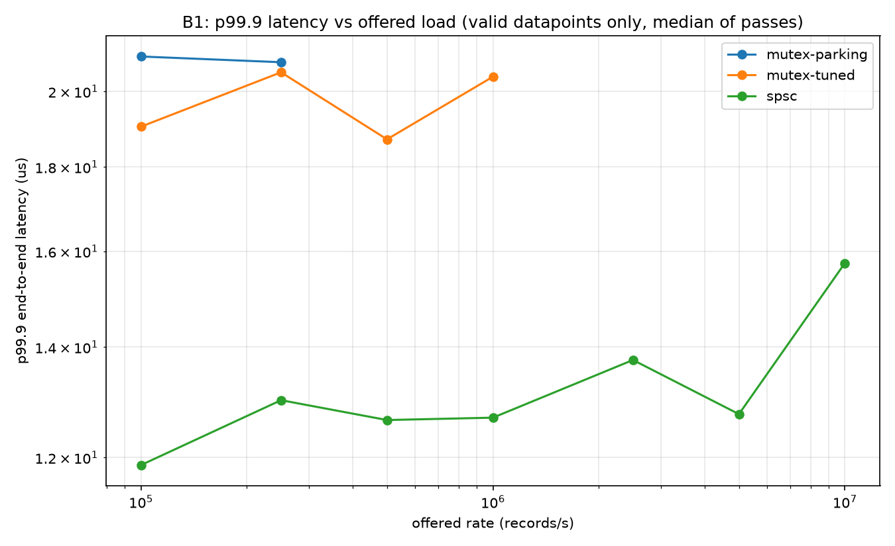
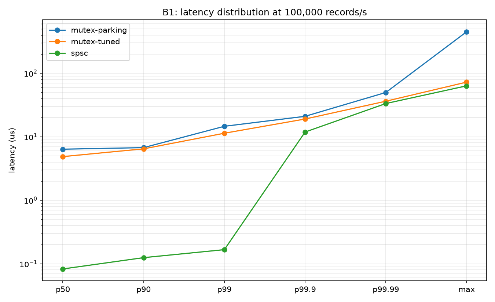

# Low-Latency Market Data Pipeline

A wait-free SPSC ring buffer feeding a market data handler, measured
against a tuned `std::mutex` + condition variable queue under controlled
offered load, on macOS/ARM64.

C++20. ~2,000 lines including tests and harnesses. Every measurement in
this README is reproducible from this repository with the commands in
[How to reproduce](#how-to-reproduce).

---

## The problem

In a trading system the thread reading the socket must never block. If it
stalls, the kernel receive buffer fills and you either drop packets or
fall behind the feed — and a stale book is worse than no book. So you
decouple: one thread does I/O and minimal parsing, hands off, and returns
immediately to the socket.

The handoff is the problem. A mutex means the producer's progress can
depend on the consumer's. Uncontended, `std::mutex` on macOS is a single
userspace atomic and is cheap. Contended, it drops into `__ulock_wait` —
a syscall that parks the thread and hands the CPU to the scheduler.

That asymmetry is the subject. The mutex is fine on the mean, because most
acquisitions are uncontended. It is expensive on the tail, because the
contended ones cost a syscall and a scheduler decision. And the tail is
what matters: the p99.9 message is disproportionately the one where the
market moved, because bursts and volatility arrive together.

---

## Results



*p99.9 end-to-end latency against offered rate, log/log, median of three
passes, valid datapoints only. The three lines converge because all three
sit on the same ~12 µs scheduler floor — see [the scheduler
floor](#the-scheduler-floor-why-p999-is-not-the-headline-here). The
baselines stop where they fail the producer-lag gate: the parking
configuration above 250k/s, the tuned one above 1M/s.*



*The same three configurations across p50 to max at a single offered
rate. The gap is widest at p50 and p99 and closes as the scheduler floor
takes over — which is the whole story of this measurement in one
picture.*

All figures from an Apple M2 (4 P-cores + 4 E-cores, fanless), mains
power, Low Power Mode off, `QOS_CLASS_USER_INTERACTIVE` requested and
**read back** on every measurement thread. Full environment dumps in
`env/`, one per measurement session.

### B1 — end-to-end latency under controlled offered load

Latency is measured from *intended* send time to consumer-processed, with
the send schedule computed before the clock starts. Median of three
passes; only datapoints passing both validity gates are shown.

Three configurations:

| Configuration | What it is |
|---|---|
| `spsc` | The wait-free ring buffer |
| `mutex-tuned` | Condvar queue, 8192-iteration consumer spin before blocking (§4's fair baseline) |
| `mutex-parking` | The same queue with a 1000-iteration spin, so it parks frequently |

**Median and p99 latency, nanoseconds:**

| Offered rate | spsc p50 | tuned p50 | spsc p99 | tuned p99 | p99 ratio |
|---|---|---|---|---|---|
| 100k/s | 83 | 4,880 | 167 | 11,380 | 68× |
| 250k/s | 83 | 334 | 125 | 9,540 | 76× |
| 500k/s | 83 | 166 | 125 | 375 | **3.0×** |
| 1M/s | 83 | 167 | 125 | 3,380 | 27× |

**p99.9 latency, microseconds:**

| Offered rate | spsc | mutex-tuned | ratio |
|---|---|---|---|
| 100k/s | 11.88 | 19.04 | 1.60× |
| 250k/s | 13.00 | 20.54 | 1.58× |
| 500k/s | 12.65 | 18.71 | 1.48× |
| 1M/s | 12.69 | 20.42 | 1.61× |

**The p99.9 ratio is small, and the reason is the most interesting result
in the project.** Both arms sit on a ~12 µs floor imposed by the machine,
not by either queue. See [the scheduler
floor](#the-scheduler-floor-why-p999-is-not-the-headline-here).

### Messages disturbed — the metric p99.9 cannot express

Counting messages delayed past 1 µs, at equal offered rate. Insensitive
to the scheduler floor that dominates both arms' upper percentiles.

| Offered rate | spsc | mutex-tuned | ratio |
|---|---|---|---|
| 100k/s | 12,081 (0.60%) | 1,062,550 (53.1%) | **88×** |

At 100k/s the tuned baseline's consumer parks on roughly half of all
messages — its 8192-iteration spin is ~10.6 µs against a 10 µs
inter-arrival gap, right at the boundary — and each park costs the
producer a wake syscall on the critical path of its own send schedule.
The lock-free arm never parks. Same machine, same rate, same scheduler
floor: 88× fewer messages delayed past a microsecond.

### The scheduler floor: why p99.9 is not the headline here

Dumping every sample above 1 µs and grouping them into stalls shows the
same structure on both arms:

| | stalls/s | gap between stalls | messages per stall |
|---|---|---|---|
| spsc @ 1M/s | 398 | 2.12 ms | median 4, max 47 |
| mutex-tuned @ 1M/s | 148 | 9.30 ms | median 4, max 75 |
| spsc @ 100k/s | 346 | 1.14 ms | median 1, max 171 |

Slow messages arrive in **contiguous runs**, not in isolation: one event
stalls the consumer for tens of microseconds and every message arriving
during the stall is delivered late together. The stall rate is a few
hundred per second regardless of arm or offered rate. That is the
scheduler taking the CPU away — the same population found in timer
calibration (§6.3) *before the queue existed*, in a loop that did nothing
but read the clock twice.

So on this hardware the upper percentiles of both arms are dominated by
the operating system, and the queue difference is only visible below
p99.9. This is the quantified version of the "no thread pinning"
limitation: macOS offers no `taskset` and no `isolcpus`, and the cost of
that shows up as a 12 µs floor on any latency distribution measured here.

**It is a limit of the measurement platform, not a null result.** The
mechanism was measured in calibration, predicted, and then observed in the
pipeline.

### A-series microbenchmarks

Two-thread queue microbenchmark, batched timing, 10M handoffs per arm.

| # | Result | Strength |
|---|---|---|
| **A1b** | Acquire-release is **1.23×** faster than `seq_cst` in the real queue (33.07 vs 26.88 M handoffs/s) | No distribution overlap. Two runs five days apart agree: 1.25 and 1.23 |
| **A1a** | Ordering cost is **not measurable** in a bare atomic ping-pong: relaxed 36.9, acq-rel 38.5, seq_cst 38.3 ns/handoff | A null result, and the explanation is the point — see below |
| **A2b** | The coherence granule is **64 bytes** — contradicting `hw.cachelinesize` (128) and libc++'s `hardware_destructive_interference_size` (256) | 64/128/256 within 0.21%; 16 bytes apart is **3.56×** slower, with no overlap |
| **A3b** | Natural 80-byte ring slots cost **1.81×** against 128-byte padded slots | No overlap; disassembly confirms both loops cover all 80 bytes |
| **A4b** | Caching the opposite index saves **~10 ns/push**, 1.36× | Cached faster in **20 of 20** paired rounds; two ring sizes agree |

**A1a's null result is more informative than a number would have been.**
A bare ping-pong serialises every handoff behind a cross-core coherence
round trip, so the measurement is coherence-bound rather than
instruction-bound and the ordering cost disappears below the noise. A1b
shows a real 1.23× because the queue pipelines across 1024 slots and has
own-index loads that change from `ldr` to `ldar` under `seq_cst`.

**Three of the M2's cache numbers disagree**, and this project can say
which one governs: `hw.cachelinesize` reports 128 (fetch granularity),
libc++ reports 256 (conservative by 4×), and A2b measures **64**
(coherence). The libc++ figure is a property of a named library version —
LLVM libc++ 220108 — and Apple's system libc++ 210106 reports the same,
so their agreement is weak evidence rather than independent confirmation.

### There is no compare-and-swap in this queue

The producer performs an atomic *load* of the head and an atomic *store*
of the tail. No read-modify-write, no `ldxr`/`stxr` exclusive pair, no
`cas`. Verified from the committed disassembly
(`evidence/spsc_arm64_disassembly.txt`), not asserted.

`std::atomic` is not buying a lock or a CAS here — a naturally-aligned
64-bit access on ARM64 is already indivisible in hardware. What it buys is
C++ semantics: data-race freedom, compiler discipline, and ordering.

The disassembly also corrected an assumption. Acquire loads compile to
**`ldapr`/`ldapur`** — ARMv8.3 RCpc — not `ldar`, and release stores to
`stlur`, an ARMv8.4 unscaled form. `ldar` is RCsc, stronger than acquire
requires; clang uses the cheaper RCpc form where the standard permits.
That is the mechanism behind A1b: sequential consistency cannot use RCpc,
so `seq_cst` forces `ldar`.

---

## Design decisions

**Single producer, single consumer, no MPMC.** Adding a second producer
means two threads want the same slot index, which needs a CAS retry loop,
which drops the guarantee from wait-free to lock-free. Wait-free is the
guarantee that matches the pitch: the entire premise is bounding the worst
case.

**Wait-free, and the full path is what makes it true.** When the queue is
full, `try_push` inspects the cached head, acquire-loads the real head
*exactly once*, and returns `false`. Two loads maximum, no branch back. A
`while (full) { reload; }` would look almost identical in review and would
silently make the producer blocking.

**Monotonic `uint64_t` counters, full advertised capacity.** The
sacrificed slot exists only when *wrapped* indices are stored, where
`head == tail` is ambiguous. With monotonic counters the unsigned
difference disambiguates: empty when `tail − head == 0`, full when
`tail − head == capacity`. Never an ordering comparison — `head < tail` is
wrong across a wrap.

**Records stored by value, fixed size.** Forced by the guarantee, not
chosen for simplicity: no allocation in a wait-free producer means memory
must be preallocated, which means slots must be fixed size. `malloc` can
take a lock, and the moment you allocate in the producer the allocator's
worst case becomes your worst case.

**Reject-newest on full; the caller's policy is drop-newest.** This is a
known semantic deviation and it is stated rather than hidden: bookTicker
is a snapshot stream, so drop-*oldest* is the semantically correct policy.
Drop-oldest is not expressible here — the producer would have to advance
the consumer-owned index, requiring a read-modify-write and a retry loop,
and it would overwrite a slot the consumer may be mid-copy on. Obtaining
drop-oldest safely needs an overwriting-ring design with consumer lap
detection and per-slot sequence validation. That design is described in
the plan and deliberately not built.

It does not contaminate any reported measurement, because **every reported
datapoint has zero drops**.

**Two counters, not one.** `full_rejections` counts `try_push` calls that
returned `false` — a queue event. `dropped_records` counts records the
*caller* abandoned — a policy decision. Harness A retries and loses
nothing; the replay producer abandons and loses one. Conflating them
double-counts, and under a zero-drop gate it would have marked every
harness A datapoint invalid.

**The mutex baseline is tuned, and the tuning is derived.** Signal only on
the empty→non-empty transition; bounded consumer spin before blocking;
identical `try_push`/`try_pop` interface and identical reject-newest
semantics, so the two arms are not doing different things above
saturation.

---

## Methodology

### Coordinated omission

The offered rate is fixed, the send schedule is computed as a pure
function of record index *before the measurement window opens*, and
latency is measured from the **intended** send time.

Pushing as fast as the consumer can drain measures throughput saturation,
not latency: when the system stalls the producer stalls with it, so the
stall never appears in any latency figure. If the producer instead
computed an intended send time at the moment it was about to push,
coordinated omission would return through the back door — the producer
stalls, the schedule slides with it, and the stall vanishes again.

### Validity gates

Every datapoint must pass two gates, both fixed numerically **before any
harness B code existed**:

1. **Zero dropped records.** Dropping is cheaper than delivering, so an
   arm that drops looks faster.
2. **p99 producer lag within one offered-rate period.** One period is the
   only threshold with a physical meaning: a producer a full inter-send
   interval behind has missed its slot, so the rate on the x-axis is not
   the rate delivered.

Maximum producer lag is **reported but is deliberately not a gate**. An
earlier draft gated on max lag at ten periods; producer characterisation
showed that gate failing by a factor of 460 at 20M/s, because OS
scheduling events have an absolute duration whatever the rate, so a gate
expressed in periods is unsatisfiable at high rates by construction. The
concept was wrong, not the constant — a single 50 µs stall in a 200,000
message run produces one large latency sample, which is data about the
tail rather than evidence the rate was not offered.

Invalid datapoints are written to the CSV with the failing gate named,
not deleted. **The mutex arm fails the lag gate at every rate at or above
2.5M/s**, and the parking configuration fails at 500k/s and above. That
is reported as a limit on the measurable range.

### Why three harnesses, not one

The timer steps in ~41.67 ns (24 MHz; `mach_timebase_info` returns 125/3,
confirmed by measurement). ARM's cycle counter is PMU-gated and unreadable
from userspace here, so 24 MHz is the ceiling rather than a default.

The handoff is ~80 ns and a JSON parse is ~1,000–3,000 ns. Hunting a 10 ns
ordering delta inside a 2,000 ns measurement gives three overlapping
distributions and nothing to report. So:

| Harness | Timing method | Produces |
|---|---|---|
| **A** | Batched: one clock read, 10M ops, one clock read | Means only |
| **B** | Per-message timestamps | Full percentile distributions |
| **C** | No timing; sequence oracle | Failure evidence |

Batching is sound for A because quantisation error is bounded at ±1 tick
*for the whole run*, not per operation. What it loses is percentiles,
which is acceptable because "what does release ordering cost" is a
question about a mean.

**Clock resolution determined which harness could answer which question.**

### Timer calibration

Read the clock twice back-to-back, ~1M times. Every result is either 0
(both reads inside one tick) or ~41.67 (a tick boundary fell between
them). The nonzero fraction times the tick period gives the loop duration
— measuring below the clock's own resolution using the statistics of when
it steps.

The outlier threshold is **70 ns, not a round number**: the
single-boundary model forbids two ticks within one iteration, so anything
at or above ~2 ticks is a model violation by definition. A threshold of
200 would have silently absorbed real violations into the normal
population.

The histogram is bimodal with nothing between, which is the evidence that
the uniform-phase assumption holds. It also found ~746 multi-tick samples
(memory stalls) and a population around **~9 µs** — context switches,
observed before the queue existed, and the same mechanism that produces
the scheduler floor in B1.

### Clock domains

Three, never to be collapsed:

| Domain | Source | Properties |
|---|---|---|
| Exchange | Binance `E`/`T` | Unix epoch ms, someone else's wall clock |
| Capture | Python `time.time_ns()` | Unix epoch ns, **NTP-disciplined, can step backwards** |
| Replay | `CLOCK_UPTIME_RAW` | Monotonic ns, boot-relative |

Capture and replay must **never** be subtracted — different origins
entirely. The field names are deliberately dissimilar so the mistake looks
wrong on the page.

Because capture timestamps are unsigned, a backwards NTP step wraps rather
than going negative, so the replay schedule is built from **cumulative
clamped gaps written as an explicit comparison**, not `max(0, b - a)` —
which is a no-op on unsigned arithmetic and would convert a millisecond
backwards step into a ~585-year forward jump.

The capture timestamp is taken *after* the Python websocket library hands
the message up, so it carries interpreter and asyncio jitter of plausibly
tens of µs. It is fine for replay pacing and burst shape. It is **not** an
arrival timestamp.

### Page warming and dataset handling

The dataset is ~734 MiB. On first traversal it is not in the page cache,
so the producer would take demand-paging faults *inside the measured
window*. The mapping is warmed before the clock starts, with an observable
side effect — a touch loop whose result is discarded is dead code at `-O2`
and clang deletes it.

Warming is then **verified** by comparing two full traversals. Note that
§6.4a of the plan records a lap-1/lap-2 floor of ~1.2 for the full
13.7M-record file, where the residual is cache warming rather than paging.
For the 2M-record slice used in B1 (~112 MB, far beyond the 16 MB L2) both
laps stream from DRAM and the ratio sits near 1.0. A ratio at 1.0 there is
correct, not a failed check.

**Do not compare across symbols.** The BTC dataset streams from DRAM; the
ETHW dataset (55,775 records, ~3.1 MB) fits in L2. Comparing them at equal
offered rate would partly compare an L2-resident read path against a
DRAM-streaming one, which has nothing to do with the queue. Experimental
arms are compared *within* a symbol.

### Ring capacity

16,384 slots (1.31 MB), chosen against a criterion fixed before the first
run: **the smallest power of two** such that dropped records are zero at
every rate below the knee and reconstructed depth stays under half of
capacity.

Smallest, not largest, and the reason is not memory. A larger ring means
the producer stores into slots that have fallen out of cache and the
consumer reads cold ones. That cost is additive and near-identical in
absolute nanoseconds for both arms — so it is a large fraction of a
dozen-instruction push and a small fraction of one that takes a lock.
Oversizing quietly narrows the gap that is the result. A4b saw exactly
this: the cached-index advantage fell from 1.400 at 5 MB to 1.359 at
80 MB.

The pilot recorded **zero dropped records at every rate on every arm**, so
the criterion is met.

### The spin count, and the derivation that was wrong

The baseline's consumer spins before blocking. Choosing that constant went
wrong in an instructive way, and both attempts are kept.

**First attempt — ski-rental.** Spinning is worth doing only while it
costs less than blocking. Spin for exactly the cost of a park and wake and
the worst case is twice optimal. `measure_condvar_wakeup` measured
park/wake at **~1296 ns** and a contended spin iteration at **~1.29 ns**,
giving 1004, rounded to 1000.

**Why it was wrong.** That model costs the *waiter* correctly and ignores
what blocking costs the *signaller*. When a consumer is parked, the
producer's `notify_one` becomes a `__ulock_wake` syscall on the critical
path of its own send schedule. In a queue whose producer must never be
delayed, that term dominates the one the model optimised.

**What measurement showed.** Sweeping the constant directly, at 1M
records/s:

| spin | parks (of 2M) | producer p99 lag |
|---|---|---|
| 1000 | 646,253 | 3,208 ns |
| 8192 | 437 | 41 ns |
| 65536 | 8 | 41 ns |

A 78× reduction in producer lag tracking a 1479× reduction in parks, and
65536 changes nothing further — so 8192 is on the flat part of the curve.
8192 iterations is ~10.6 µs, which exceeds the inter-arrival gap at every
rate at or above ~95k/s. That bound is the justification, rather than a
fitted crossover.

**What it does not fix.** Above ~2.5M/s the spin budget stops mattering
entirely: parks fall from 69,674 to 3 and producer lag does not move
(5,891 vs 6,358 ns). There the cost is the lock itself, and the baseline's
ceiling is real.

`measure_condvar_wakeup` is kept in the repository with its model's
limitation documented in place. Its measurements are correct; the
inference from them to a spin count was not.

### Thermal and scheduling mitigations

A fanless M2 throttles under sustained load, so arms are **interleaved and
their order alternated between passes** rather than run in sequence —
thermal drift then spreads across conditions instead of loading onto
whichever ran last.

There is no thread pinning on macOS. `QOS_CLASS_USER_INTERACTIVE` biases
toward P-cores; it is a hint, not a guarantee. The class is **read back
after being set** and the run aborts if it did not apply — a request that
silently did nothing is worse than not making it. Applying it reduced
within-arm spread on A1 from 21.1% to 5.0%.

---

## Correctness evidence

**ThreadSanitizer clean on the valid arms**, on two toolchains (Homebrew
clang and AppleClang). Both are LLVM/libc++ lineage, so this is stated as
"two LLVM toolchains" rather than as independent confirmation; libstdc++
on Linux ARM64 would be the genuinely independent data point and remains
open.

**The C1 broken-ordering arm is expected to be flagged**, and that report
is the evidence rather than a failure of the criterion. C1 removes the
synchronises-with edge, producing an intentionally invalid C++ program: a
data race on the non-atomic payload. Its throughput is not reported,
because a number produced by a program with undefined behaviour is not a
measurement of anything — and the error runs in the unfavourable
direction, since UB licenses transformations a correct program would not
permit.

**The tearing signature was predicted before the run.** From the ring
geometry, a consumer reading a slot before the payload writes are visible
should see a sequence of exactly `N − capacity` beside fresh price fields.
The prediction was committed first; the observed corruption matched.

**Sequence oracle.** A dropping queue makes gaps legal, so "I saw a gap"
proves nothing. Three checks: strict monotonicity (no legal drop policy
can produce a repeat or a decrease), gap reconciliation against
`dropped_records`, and tearing detection.

The reconciliation has **three terms**, and the boundary terms are not
optional:

```
leading  = first_delivered_sequence - first_sequence
trailing = (first_sequence + slice_length - 1) - last_delivered_sequence
interior = sum over consecutive delivered pairs of (seq[i] - seq[i-1] - 1)

leading + interior + trailing == dropped_records
```

Summing only the interior gaps misses records abandoned before the first
delivery or after the last — and it does not report an error, it reports
agreement while missing drops. Removing the trailing term makes the test
fail by exactly one record. Under drop-newest the last records of a
saturated run are disproportionately likely to be the abandoned ones.

Gap width is also not always 1: each abandoned record contributes exactly
one to the total, but *k* consecutive abandonments merge into a single
observed gap of width *k*. The invariant is the sum, never the individual
widths.

**2×10⁹-message stress run**, dense sequence, zero drops.

**Parser validated exhaustively and independently.** All 13,749,492
records round-tripped against their originating log lines by a separate
Python implementation using `decimal.Decimal` — not the C++ parser, so a
shared digit-counting bug cannot cancel itself out. A deliberate one-byte
corruption of the binary was detected and named. A deliberately malformed
input caused the converter to fail loudly and leave neither `.bin` nor
`.bin.tmp` behind.

**Byte-identical output across two conversions** six days apart on
different commits: 13,749,492 records identical, with only the provenance
fields differing.

**Checks that abort rather than warn.** Harness B enforces, at run time
and at `-O2`: `full_rejections == dropped_records` (the two counters must
agree under drop-newest with no retry), `book_updates == delivered` (the
consumer did the work the methodology claims), and QoS applied on both
threads. `assert` is not used for these — both build presets define
`NDEBUG`, which once left the entire parser test suite compiling to
nothing and exiting 0 for three days.

---

## How to reproduce

Requires Homebrew LLVM (not Apple Clang), CMake, and a Binance capture.

```sh
cmake --preset default
cmake --build --preset default
ctest --test-dir build/default --output-on-failure

# Convert a capture to the binary dataset, then validate it exhaustively
./build/default/convert_capture <capture.log> <out.bin> BTCUSDT \
    $(git rev-parse HEAD) 0
python3 tools/validate_capture.py <capture.log> <out.bin>

# Record the environment before every measurement session
bash env/dump_environment.sh

# A-series microbenchmarks. <experiment> is one of:
#   a1   a2   a2b   a3b   a4   a4b
# a1 runs both A1a (atomic-only, three orderings) and A1b (queue arms).
./build/default/harness_a $(git rev-parse HEAD) 0 a1

# B1 load sweep, both baseline configurations
./build/default/harness_b $(git rev-parse HEAD) 0 <out.bin> BTCUSDT book 3 8192
./build/default/harness_b $(git rev-parse HEAD) 0 <out.bin> BTCUSDT book 3 1000

# Post-processing and graphs. The tables print with the standard library
# alone; the graphs need matplotlib, which on a Homebrew Python needs a
# virtual environment (PEP 668).
python3 -m venv .venv && .venv/bin/pip install matplotlib
.venv/bin/python tools/analyse_harness_b.py results/harness_b_spin8192_*.csv \
                                            results/harness_b_spin1000_*.csv

# Tail structure
./build/default/harness_b $(git rev-parse HEAD) 1 <out.bin> BTCUSDT book dump
python3 tools/analyse_tail_samples.py results/tail_samples_*.csv
```

Measurement runs require mains power and Low Power Mode off. The harness
records its own git commit, dirty flag, UTC timestamp, capacity, spin
count and QoS class into every results file, so each artifact is
self-describing rather than paired with an environment dump by timestamp.

Every invocation above has been run as written. The two dirty flags differ
deliberately: measurement runs pass `0` and require a clean tree, while the
tail dump passes `1` because it is a diagnostic rather than a reported
result and is expected to run against modified source.

---

## Limitations

**The upper percentiles measure the operating system, not the queue.**
Both arms sit on a ~12 µs floor from scheduler stalls arriving a few
hundred times per second. Below p99.9 the queue difference is clean;
at p99.9 it compresses to ~1.6×. Bare-metal Linux with thread pinning
would resolve this; macOS offers no equivalent.

**No thread pinning, and heterogeneous cores.** `QOS_CLASS_USER_INTERACTIVE`
biases toward P-cores but the scheduler can still move a thread mid-run.
Expect higher run-to-run variance than a pinned Linux box would show.

**No PMU access.** `perf c2c` for false-sharing counter evidence is Linux
+ PMU only, so A2b infers the coherence granule from timing rather than
from counters.

**Coarse timer.** ~41.67 ns per tick. On x86, `rdtsc` is over 100× finer.
This methodology exists *because* the ARM timer is coarse.

**SPSC only.** MPMC would need a CAS on slot claim and would drop the
guarantee to lock-free. Not built, deliberately.

**Drop-newest, where the stream wants drop-oldest.** Described above; no
reported measurement drops, so nothing in the results depends on it.

**Variable-length records not supported.** A record cannot straddle the
wrap point, which would need padding records and would cost the clean
power-of-two bitmask. Aeron does this properly; out of scope here.

**Binary format is deliberately non-portable.** Native little-endian,
enforced by a host-endianness `static_assert`. An `endianness` byte would
be decoration: a big-endian host would read `record_count` — byte-swapped
— *before* reaching a field telling it the file is little-endian.

**Format v1 assumes SHA-1 git object ids.** The header stores a raw
20-byte commit id. A SHA-256 repository requires `format_version` 2.

**The "messages disturbed" comparison uses a fixed 1 µs threshold**, so it
is only meaningful where one arm crosses it and the other does not. At
1M/s the tuned baseline's per-message cost falls below the threshold and
the comparison inverts — that is an artifact of the fixed threshold, not
a reversal.

**Two toolchains, one lineage.** Homebrew clang and AppleClang are both
LLVM/libc++. libstdc++ on ARM64 Linux remains the outstanding independent
check, both for ThreadSanitizer and for the interference-size constants.

**B2 and B3 are not complete.** The burst-replay compression factor and
the parse-in-ingest comparison are specified but not measured.